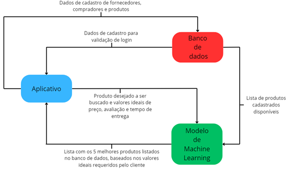

# Challenge-IA
## Objetivo

No mundo cada vez mais complexo do mercado tecnológico, encontrar produtos adequados às 
necessidades específicas tornou-se um desafio significativo. Nesse contexto, apresentamos 
nossa proposta tecnológica revolucionária: um sistema de busca personalizado alimentado por 
um algoritmo inteligente. Esta aplicação visa transformar a experiência de compra de 
profissionais e entusiastas do setor de tecnologia, simplificando o processo de seleção e 
economizando tempo valioso.

Nossa aplicação inovadora utiliza um formulário de busca personalizado para ajudar os usuários 
a encontrarem os produtos mais relevantes em tempo real. Com base nas informações 
fornecidas, nosso algoritmo inteligente analisa vastas opções disponíveis no mercado 
tecnológico, apresentando as escolhas mais adequadas de forma instantânea. Essa abordagem 
centrada no cliente não apenas lista produtos, mas também oferece uma jornada de compra 
mais inteligente e eficiente.

## Equipe

• Matheus Martins da Rocha - RM96505 Turma: 2TDSPT (responsável pela entrega de 
Enterprise APPLICATION DEVELOPMENT e DataBase Application e Data Science)

• Guilherme Raul Varella - RM97166 Turma: 2TDSPT (responsável pela entrega de DevOps 
Tools e Cloud Computing)

• Pedro Fontanez Bravo - RM97366 Turma: 2TDSPT (responsável pela entrega de 
Disruptive Architectures IT, IoB e IA)

• Felipe Rios Miranda - RM96726 Turma 2TDSPT (responsável pela entrega de Compliance 
e Quality Assurance )]

• Augusto de Carvalho Vertolis Santana - RM96518 Turma 2TDSPT (responsável pela 
entrega de Hybrid Mobile App Development e Digital Business Enablement)

## Arquitetura Geral

### • Principais componentes

Para realização das funções aplicadas em inteligência artificial, utilizamos o modelo
KNeighborsClassifier (SKLearn), que recebe as informações de busca do aplicativo UrBuy e, por
fim, avalia as cinco melhores opções de compra de acordo com os produtos listados no banco 
de dados Oracle da plataforma.

### • Interação dos componentes

## Modelagem de dados

### • Dados de treinamento do modelo

Para o treinamento do modelo foi utilizado o dataset ‘All Eletronics.csv’ disponível na página
Amazon Products Sales Dataset 2023, na plataforma Kaggle. A base de dados apresenta 
aproximadamente 9600 produtos, com 9 colunas de informações, sendo elas: “name”, 
“main_category”, “sub_category”, “image”, “link”, “ratings”, “no_of_ratings”, “discount_price”
e “actual_price”.

### • Pré-processamento

Com o intuito de limpar e tratar os dados, foram mantidas somente as colunas relevantes para 
a avaliação, sendo elas: “name”, “actual_price”, “ratings” e “image” (utilizada somente para 
demonstração dos resultados ao apresentar o top 5), também excluindo linhas com valores 
nulos nessas 3 colunas. Além disso, os valores de preço estavam apresentados em Rupias 
Indianas (₹), portanto, foi feito a conversão para Reais (R$) utilizando a cotação de outubro de 
2023 (aproximadamente ₹ 0,06 para R$ 1,00). Por fim, foi criada uma coluna “Delivery Time”
adicionando valores aleatórios de 0 a 10 representando dias úteis para o prazo de entrega, a fim 
de utilizá-los para os testes.

## Desenvolvimento do modelo

### • Modelo de Machine Learning

O modelo de aprendizado de máquina utilizado foi o KNeighborsClassifier, treinado para
encontrar as 5 melhores opções de produtos com base nos critérios de “ratings”, “actual_price”
e “Delivery Time” (Hiperparâmetros: n_neighbors=5). Os valores das 3 colunas foram 
normalizados utilizando MinMaxScaler e foi criada uma coluna de pontuação fazendo a média 
dos parâmetros com os seguintes pesos: ratings = 0.4, actual_price = 0.3 e Delivery Time = 0.3.

## Implantação

### • Tecnologias utilizadas

Para implantação do modelo foram utilizadas as seguintes tecnologias:
- Google Colab
- SkLearn: MinMaxScaler, KNeighborsClassifier e train_test_split
- Python Pandas
- IPython display

### • Ambiente de Implantação

Atualmente o projeto está implantado localmente, porém futuramente integraremos suas 
funcionalidades ao ambiente de nuvem Azure.

### • Explicando o modelo

As previsões são obtidas através da comparação dos valores da coluna de Pontuação, onde o 
usuário, através de um input, informa os valores ideias que está buscando no produto desejado, 
colocando sua expectativa de preço, tempo de entrega e avaliação. Dessa maneira, o modelo de 
classificação aplica a normalização dos dados informados e gera também uma pontuação, 
varrendo os produtos e encontrando opções semelhantes ou próximas aos valores que o usuário 
digitou.

## Manutenção e Atualização

### • Atualização do modelo

Ao tratar das atualizações dessa funcionalidade, projetamos para o futuro sofisticar ainda mais 
o modelo, passando para um aprendizado de redes neurais, que está em fase de 
desenvolvimento, aumentando ainda mais a precisão da busca e trazendo os melhores 
resultados para o usuário. Além disso, atualmente utilizamos a base de dados da Amazon com 
valores desatualizados e, alguns, fictícios, com o intuito de avaliar o desempenho do modelo, 
porém, em breve, ele será aplicado ao próprio sistema UrBuy, usufruindo de informações e 
produtos presentes em nosso próprio banco de dados.

UrBuy ©, 202
